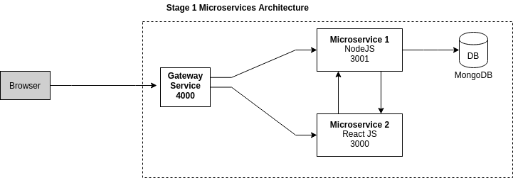

# Building Microservice 2020

Building microservices using Node.js, Spring Boot, Docker, nginx and Consul. 

### Commands
```
$ sudo docker-compose -f docker-compose.dev.yml down && sudo docker-compose -f docker-compose.dev.yml  up --build
```

### Phase 1 Microservice Architecture
